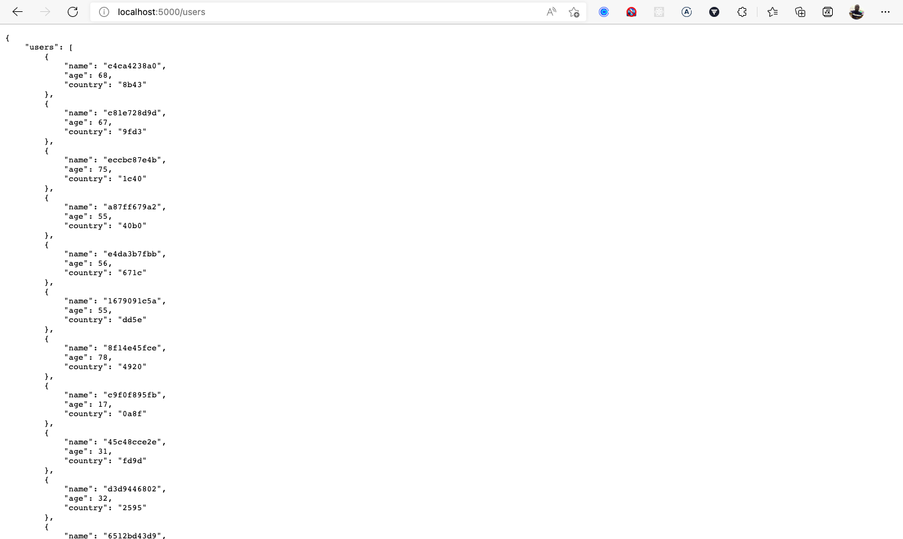

# PowerToFly

PowerToFly code challenge

This project uses Github Actions and Git for CI/CD to build and push the image to Docker Hub.If you want to contribute, create a pull request or raise an issue.

**Tech Stack**

- Flask
- Postgresql
- Redis
- Docker

# SETUP

## Docker

Clone this repo to your local machine.

```
git clone https://github.com/GwamakaCharles/users_app_be/
cd users_app_be
```

Rename the .env.example to .env

```bash
mv .env.example .env
```

Run the project locally

```
docker-compose up -d --build
```

The app will be running on port 5000 so you can access it at http://localhost:5000

## Note: Visit the root endpoint first so that flask can create the users_app_db database and users table.

Connect to the database using the following command

```
docker exec -it users_app_db psql -U postgres
```

Or use the [Postico](https://eggerapps.at/postico/) utility to connect to the database using the database credentials available in the docker-compose.yml file. Remember to refresh the app after each command.

Fill the users table with dummy data using the following command

```sql
insert into users (
	name, age, country)
select
	left(md5(i::text), 10),
	(floor(random() * 100 + 1)::int),
	left(md5(random()::text), 10)
from generate_series(1,1000000) s(i);
```

## Deploy to Azure AKS

If you don't have a free azure account you can create one [here](https://azure.microsoft.com/en-us/free/)

Login to Azure CLI

```
az login
```

Enable Operational Management and Insights for your cluster

```bash
az provider register --namespace Microsoft.OperationsManagement
az provider register --namespace Microsoft.OperationalInsights

```

Verify Microsoft.OperationsManagement and Microsoft.OperationalInsights are registered on your subscription. To check the registration status:

```bash
az provider show -n Microsoft.OperationsManagement -o table
az provider show -n Microsoft.OperationalInsights -o table
```

Create a resource group using the az group create command.

```bash
az group create --name myResourceGroup --location eastus
```

Create an AKS cluster using the az aks create command with the --enable-addons monitoring parameter to enable Azure Monitor container insights.

```bash
az aks create --resource-group myResourceGroup --name myAKSCluster --node-count 1 --enable-addons monitoring --generate-ssh-keys
```

To manage a Kubernetes cluster, use the Kubernetes command-line client, [kubectl](https://kubernetes.io/docs/reference/kubectl/kubectl/).

```bash
az aks get-credentials --resource-group myResourceGroup --name myAKSCluster
```

Verify the connection to your cluster using the _kubectl get_ command. This command returns a list of the cluster nodes.

```bash
kubectl get nodes
```

Deploy the application using the _kubectl apply_ command:

```bash
kubectl apply -f k8s_infrastructure/
```

The following screen shows the deployment of the application.


Visit the The EXTERNAL-IP output for the web service after the deployment completes.


Don't Forget to populate the database with Dummy Data

## Note: To avoid Azure charges, clean up your unnecessary resources

```bash
az group delete --name myResourceGroup --yes --no-wait
```

**API Endpoints**

Read the _api.yaml_ file first to understand how the API endpoints are used.

## There are three endpoints available:

`[GET] /`

- Returns a home with some instructions

`[GET] /users`

- Returns a list of all users.
  

for filtering the users, you can use the following query parameters:
`[GET] /user/<name>`

- Brings user with the given name.
  for example: `/user/john` will bring the user with name `john`.

for pagination, you can use the following parameters:

- page: the page number, default value is 1
- per_page: the number of results per page, default value is 20
  for example:
  `[GET] /users?page=2&per_page=10`
- Brings the second page of 10 users.
